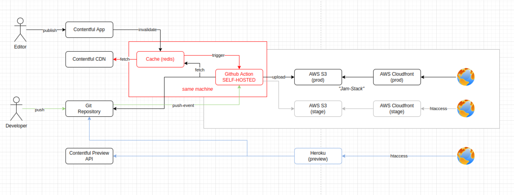

# PU Documentation
## Used technologies
- CSS / SCSS
- Javascript
- Vue 2 / Nuxt 2 (Node 14.x)
- Rest/GraphQL
- AWS (static site rendered content for production and stage)
- Heroku (preview for production and stage)
  ​
## Contentmodel
https://app.contentful.com/spaces/q17uls4wkkdz/visual_modeler/content_types
​
## Data Fetching
### via REST (Contentful Client)
- Article Pages
- Core Pages
- Customer Pages
- Event Pages
- News Pages
- Partner Pages
- PPC Pages
- Webinar Pages
  ​
### via REST (Greenhouse Adapter)
- Career Pages
  ​
### via GraphQL
- Channel Pages
- Glossary Pages
  ​
## Deployment
To save costs and build minutes on GitHub, a more complex mechanism for the CI pipeline has been developed.
A build consists of 2 parts: the trigger and the build itself.
​
The trigger uses the GitHub CI server directly and just calls a webhook on an AWS EC2 instance.
On the EC2 instance, a separate instance is launched, the actual build is triggered on GitHub, and the launched
EC2 instance will be shut down 30 minutes after the latest build.
​
A custom GitHub CI server runs on the spun up EC2 instance, which then runs the actual build.
Building the static page with Nuxt and uploading it to the appropriate AWS S3 buckets.
The whole process takes about 20 minutes and can be monitored in the following overview https://productsup-publish-queue.herokuapp.com/.
​
## Infrastructure
- In Directory `infrastructure`
- AWS-CDK (AWS Cloud Development Kit)
- See Documentation: https://aws.amazon.com/de/cdk/
- Stacks:
  - `CertificateStack` (only for the SSL Certificate, needs to be hosted in us-east-1)
  - `WebsiteStack` (Production Stack)
    - S3 Bucket
    - CloudFront
    - EdgeLambdas
  - `StageStack`
    - See `WebsiteStack`
  - `ErrorStack` (Sources for this bucket are uploaded manually)
    - S3 Bucket

For the commands to work, you need to have the `AWS-CDK` installed and need to be logged in.
The Default Credentials need to point to the AWS Instance that you want to operate on.
​
- Manually provisioned sources:
  - 3 EC2 Instances (instance type)
    - Trigger and Dispatcher (t2.micro)
    - Custom GitHub CI Server (t2.2xlarge)
    - Custom GitHub CI Server (t2.2xlarge)

__IMPORTANT__: Sometimes, github removes self hosted CI-Servers if it was not used for a long time (`stage` is a common case for that).
It needs to be reregisteren then.
Commands to execute, to (re)register the runner:
The runner needs to run as a daemon to be detached from the session and be restartet after the server was shutdown
​
```bash
# Stop the server
sudo ./svc.sh stop
# Remove it from systemctl
sudo ./svc.sh uninstall
​
# Remove old runner configuration
rm .runner
# Register runner
./config.sh --url <runner-url> --token <registration-token>
​
# Add (install) runner to systemctl
sudo ./svc.sh install
# Start runner with systemctl
sudo ./svc.sh start
```
​
The runner needs to be registered with a specific tag. See the GitHub-CI scripts for the tag names.

## Migrations
After changing the content model of contentful (for example in order to implement altered or new requirements), the content model of the target system has to be altered accordingly. That is called migration in contentful's context. Migrations that are more complex are done with the `contentful-management` library.
Example code files can be found in the `migrations` directory.
This is just a recommendation.

## Architecture

